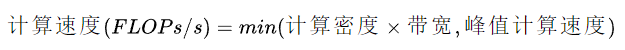
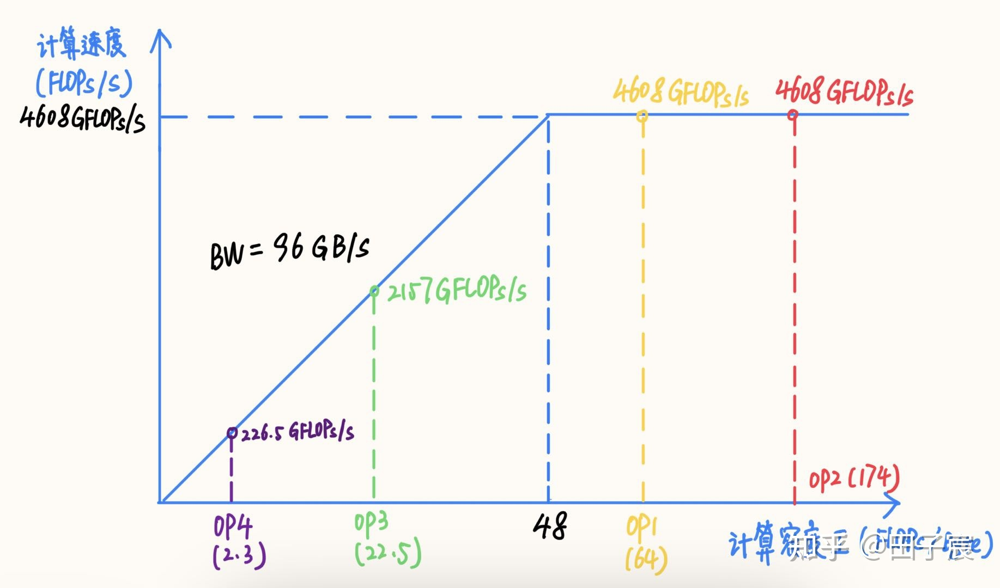
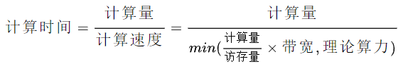
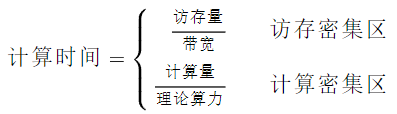
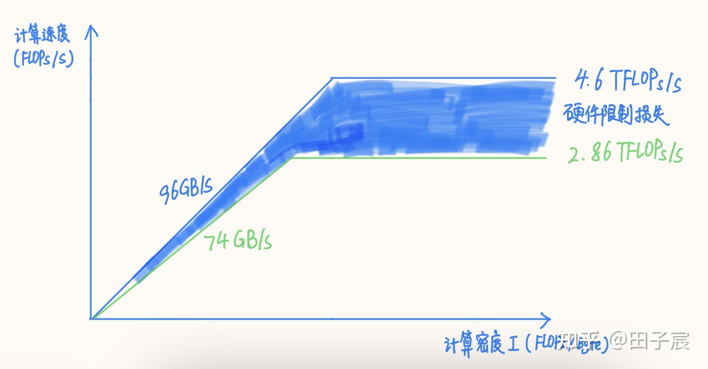
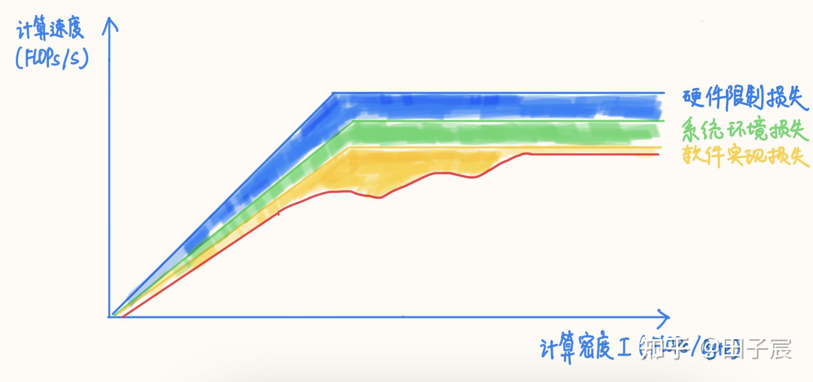

# 深度学习模型大小与模型推理速度的探讨

2021.11.12

> Source: [https://zhuanlan.zhihu.com/p/411522457](https://zhuanlan.zhihu.com/p/411522457)

## 1. 常用评估指标

1. 计算量
    * FLOPs：Floating Point Operations，浮点计算次数。
2. 参数量
    * 参数量是模型中的参数的总和，跟模型在磁盘中所需的空间大小直接相关。
    * 参数量往往是被算作访存量的一部分，因此参数量不直接影响模型推理性能。但是参数量一方面会影响内存占用，另一方面也会影响程序初始化的时间。
3. 访存量
    * 访存量是指模型计算时所需访问存储单元的字节大小，反映了模型对存储单元带宽的需求。访存量一般用 Bytes（或者 KB/MB/GB）来表示，即模型计算到底需要存/取多少 Bytes 的数据。
    * 和计算量一样，模型整体访存量等于模型各个算子的访存量之和。对于 Eltwise Sum 来讲，两个大小均为 (N, C, H, W) 的 Tensor 相加，访存量是(2 + 1) x N x C x H x W x sizeof(data_type)，其中2代表读2个Tensor，1代表写1个Tensor。
    * 访存量对模型的推理速度至关重要，设计模型时需要予以关注。
4. 内存占用
    * 内存占用是指模型运行时，所占用的内存/显存大小。一般有工程意义的是最大内存占用，内存占用≠访存量。
    * 和参数量一样，内存占用不会直接影响推理速度，往往算作访存量的一部分。

## 2. 计算量越小，模型推理就越快吗？

实际上计算量和实际的推理速度之间**没有直接的因果关系**。计算量仅能作为模型推理速度的一个参考依据。

模型在特定硬件上的推理速度，除了受计算量影响外，还会受访存量、硬件特性、软件实现、系统环境等诸多因素影响，呈现出复杂的特性。因此，有硬件且测试方便的情况下，实测是最准确的性能评估方式。

### 2.1 计算密度与RoofLine模型

计算密度是指一个程序在单位访存量下所需的计算量，单位是 FLOPs/Byte：

<!--  -->

    

RoofLine 模型是一个用于评估程序在硬件上能达到的性能上界的模型，可用下图表示：

<!--  -->

    

用公式描述：

<!--  -->

    

当程序的计算密度I较小时，程序访存多而计算少，性能受内存带宽限制，称为**访存密集型程序**，即图中橙色区域。在此区域的**程序性能上界=计算密度×内存带宽**，表现为图中的斜线，其中斜率为内存带宽的大小。计算密度越大，程序所能达到的速度上界越高，但使用的内存带宽始终为最大值。

反之如果计算密度I较大，程序性能受硬件最大计算峰值（下文简称为算力）限制，称为**计算密集型程序**，即图中蓝色区域。此时**性能上界=硬件算力**，表现为图中的横线。此时计算速度不受计算密度影响，但计算密度越大，所需内存带宽就越少。

在两条线的交点处，计算速度和内存带宽同时到达最大值。在不同设备上，同一个程序的性质可能发生变化。例如上图中的程序2，在算力稍弱的设备2上属于计算密集型程序，而在算力较强的设备1上就属于访存密集型程序了。如果想要充分发挥设备1的性能，应当适当加大程序的计算密度（比如到程序3的位置）。

### 2.2 计算密集型算子与访存密集型算子

网络中的算子可以根据计算密度进行分类。一般来讲，Conv、FC、Deconv算子属于计算密集型算子；ReLU、EltWise Add、Concat等属于访存密集型算子。同一个算子也会因参数的不同而导致计算密度变化，甚至改变性质，比如在其他参数不变的前提下，增大Conv的 group，或者减小Conv的input channel都会减小计算密度。

算子的计算密度越大，约有可能提升硬件的计算效率，充分发挥硬件性能。我们以一个Intel X86服务器平台为例（10980 XE）。该平台CPU频率为4.5GHz，我们以16核为例，其理论FP32算力为4.608TFLOPs/s，内存带宽理论值为96GB/s。在此平台上的RoofLine模型为：

<!--  -->

    

该平台“拐点”的计算密度为48，计算较为密集的OP1和OP2处在计算密集区，能够达到平台的算力峰值；而OP3和OP4处在访存密集区，受内存带宽限制不能到达算力峰值，尤其是OP4，由于计算访存比过低，计算效率仅有可怜的4.9%，计算效率并不高。

### 2.3 推理时间

按照RoofLine模型，我们很容易就能得到算子实际的执行时间：

<!--  -->

    

这是一个分段函数，拆开来可得：

<!--  -->

    

一句话总结：**对于访存密集型算子，推理时间跟访存量呈线性关系，而对于计算密集型算子，推理时间跟计算量呈线性关系**。按照 RoofLine 模型，在计算密集区，计算量越小，确实推理时间越小。但是在访存密集区，计算量与推理时间没关系，真正起作用的是访存量，访存量越小，推理的时间才越快。在全局上，计算量和推理时间并非具有线性关系。

### 2.4 小结

从上面的讨论中我们可以看出：计算量并不能单独用来评估模型的推理时间，还必须结合硬件特性（算力&带宽），以及访存量来进行综合评估。并非是计算量越低模型推理越快。在评价模型大小时，也建议加上访存量作为重要的评价指标。

需要强调的一点是，不同的硬件平台峰值算力和内存带宽不同，导致同一个模型在平台1上可能是计算密集的，在平台2上可能就变成了访存密集的。例如上文提到的Intel X86平台，“拐点”值为48，而NVIDIA V100“拐点”值为173.6，上文举的例子在V100平台上仅有OP2落在了计算密集区，剩下的全部是访存密集的。因此，同样的模型在不同平台上性质可能会发生改变，需要具体情况具体分析。

我们很难给出一个通用性的结论，究其原因是RoofLine模型本身是一个非线性模型。这里必须要强调一点的是，除了峰值算力和内存带宽之外，还有硬件限制、系统环境、软件实现等诸多因素会影响程序的实际性能，使得其非线性特性更加严重。因此RoofLine模型仅仅只能提供一个性能上界的评估方式，并不代表能够达到的实际性能。实际性能最准确的测量方式只有真机实测。

RoofLine模型更重要的是提供了一种分析性能的思想，即计算密集型程序更多的受限于硬件算力，而访存密集型程序更多的受限于硬件内存带宽。在理解这一点的基础上设计网络结构，并分析网络的性能，将更有理论参考。

## 3. 影响模型推理性能的其他因素

### 3.1 硬件限制对性能上界的影响

前面 RoofLine 模型使用的峰值算力及内存带宽，是根据纸面数据计算得到的，是理论上的最大值。但在实际情况下，硬件会因为种种原因，无法达到这个理论值。因此建议大家对硬件进行**micro-benchmark**，以获取硬件的真实性能上限。

以上文的 Intel X86 CPU 为例，我们之前计算的 avx512 理论算力为 4.608 TFLOPs/s，但这个数值的前提是频率能维持在 4.5 GHz。然而实际上在使用 16 核跑 avx512 指令时，CPU 频率会下降到约 2.9 GHz，此时理论算力仅剩下 2.96 TFLOPs/s，而实测值仅有 2.86 TFLOPs/s。

除了频率之外，有些芯片可能会因为一些设计上或实现上的原因，导致在实际使用时达不到理论峰值。比如一些低端芯片不支持多发射、不支持乱序执行、采用了阻塞式 Cache 等等，一些芯片甚至会有一些性能 bug，导致在实际使用时几乎到达不了理论峰值（这里我个人倾向于把这些原因归结为硬件限制带来的损失）。

内存同理，该平台理论带宽为 96GB/s，但实测下来最高读带宽仅有 74 GB/s，仅能到达理论带宽的 77%。

我们可以得到修正后的 RoofLine 模型，图中蓝色填充部分反映了因实际算力和内存带宽达到不了理论值而造成的损失：

<!--  -->

    

修正后的模型“拐点”发生了变化，因此算子的性质也会发生变化。建议拿到硬件后对硬件进行 micro-benchmark，这里推荐两个测试工具：[浮点峰值](https://zhuanlan.zhihu.com/p/28226956)和[stream](https://www.cs.virginia.edu/stream/)。

### 3.2 系统环境对性能的影响

除非程序运行在裸机中，否则操作系统一定会对性能上界产生一定影响，比如操作系统在多核间的调度损失、操作系统的内存管理带来的损失、操作系统本身占用的运算资源等等。

对于一般的深度学习推理任务而言，现代操作系统对性能的影响并不是特别明显。但是在一些特殊情况下，也会带来严重的性能损失。我这里将会举两个例子：

一个是 Android 系统在大小核上的调度，一旦程序在 CPU 上的占用率不足（比如是周期工作的任务），则有可能被 Android 调度到小核上，带来性能损失。

另一个例子是内存缺页。在 Linux 系统上，当向系统申请内存页后，系统只是返回了虚拟页，等到程序实际使用虚拟页时，才会通过触发缺页异常的方式，进入操作系统内核分配物理页，这一过程会严重降低性能。

好在这些问题可以通过软件进行一部分弥补，例如调度问题可以使用绑核来解决，缺页问题可以通过绑定物理页（需要内核态）或内存池来解决。因此操作系统带来的影响是可控的。

除了操作系统带来的影响，系统中运行的其他进程也会对当前进程造成影响。比如一个系统中运行了多个深度学习实例，或者系统后台一些 APP 自启动了等等。这些进程都会占用核心算力和内存带宽，造成当前进程性能损失。

这往往会导致在工程测试环境下性能达标的模型，在实际部署时性能下降。因此，必须关注工程测试环境和实际部署系统环境的差异。如有条件，最好在实际部署环境下进行测试。

### 3.3 软件实现对性能的影响

除了硬件限制和系统环境外，**一个任务的软件实现好坏对性能有着重大的影响**。

例如对于同样的矩阵操作任务，使用 python 写的多重 for 循环，和用 numpy 高度优化过的矩阵操作函数，性能可以差出 1~2 个数量级。

对于深度学习模型推理而言，推理框架对模型性能的影响主要体现在：是否充分利用了硬件的流水线资源、是否高效利用了硬件中的缓存、是否采用了时间复杂度更低的算法、是否解决了操作系统带来的性能损失（如上文的调度问题和内存缺页问题）、是否进行了正确高效的图优化等等。

由于影响因素很多，因此软件对性能的影响往往呈现出很强的非线性，导致在评估性能时很难给出一些普适性的结论，很多时候只能具体情况具体分析。

例如同样计算量的向量四则运算和超越函数，后者往往会慢于前者的原因是很多硬件不支持超越函数的 SIMD 指令；再比如空洞卷积（dilated Conv）性能会弱于普通卷积的原因是前者对访存的利用不如后者高效等等。

在软件实现的影响下，RoofLine 模型的上界再次下降，达到图中的红线（真实的非线性可能会比我随手画的要复杂的多）：

<!--  -->

    

因此，在评估或分析深度学习推理性能时，简单的计算量/访存量指标是完全不够的，只能做个性能上界参考。实际能达到的性能其实还要关注很多很多因素，例如算子的访存模式、数据排布、是否能够进行图融合、是否有精度可接受的低时间复杂度算法、算法并行度是否充足、各种运算的比例等等因素。

这些因素对于算法同学而言可能过于复杂，并不需要掌握。但如果所在的公司/部门有交流的机会的话，可以跟部署/优化的同学针对模型结构和算子进行探讨，以获取性能优化的建议。

这里可以一些一般性的结论，仅供参考：

* 对于一些访存非常密集且访存 pattern 连续的算子，如 Concat、Eltwise Sum、ReLU、LeakyReLU、ReflectionPad 等，在 Tensor 数据量很大的情况下，软件实现的损失会非常小，正常情况下基本都能达到内存带宽实测上限；如果框架采用了融合策略的话，基本可以达到 0 开销。
* 对于 Conv/FC/Deconv 等算子，在计算密度很高的情况下，大多数框架是能够很接近算力峰值的。但对于计算密度不是特别高的 case，不同框架的表现不一，需要实测才能确定。不过从大趋势而言，都是计算密度越高，硬件的利用率越高的。
* 尽量使用常用的算子参数，例如 Conv 尽量使用 3x3_s1/s2，1x1_s1/s2 等，这些常用参数往往会被特殊优化，性能更好。

## 4. 面向推理速度的模型设计建议

1. 方法论建议：
    * 了解目标硬件的峰值算力和内存带宽，最好是实测值，用于指导网络设计和算子参数选择。
    * 明确测试环境和实际部署环境的差异，最好能够在实际部署环境下测试性能，或者在测试环境下模拟实际部署环境。
    * 针对不同的硬件平台，可以设计不同计算密度的网络，以在各个平台上充分发挥硬件计算能力（虽然工作量可能会翻好几倍）。
    * 除了使用计算量来表示/对比模型大小外，建议引入访存量、特定平台执行时间，来综合反映模型大小。
    实测是最准确的性能评估方式，如果有条件快速实测的话，建议以实测与理论分析相结合的方式设计并迭代网络。
    * 遇到性能问题时，可以逐层 profiling，并与部署/优化同学保持紧密沟通，具体问题具体分析（适当了解一下计算相关理论的话，可以更高效的沟通）。
2. 网络设计建议：
    * 对于低算力平台（CPU、低端 GPU 等），模型很容易受限于硬件计算能力，因此可以采用计算量低的网络来降低推理时间。
    * 对于高算力平台（GPU、DSP 等），一味降低计算量来降低推理时间就并不可取了，往往更需要关注访存量。单纯降低计算量，很容易导致网络落到硬件的访存密集区，导致推理时间与计算量不成线性关系，反而跟访存量呈强相关（而这类硬件往往内存弱于计算）。相对于低计算密度网络而言，高计算密度网络有可能因为硬件效率更高，耗时不变乃至于更短。
    * 面向推理性能设计网络结构时，尽量采用经典结构，大部分框架会对这类结构进行图优化，能够有效减少计算量与访存量。例如 Conv->BN->ReLU 就会融合成一个算子，但 Conv->ReLU->BN 就无法直接融合 BN 层
    算子的参数尽量使用常用配置，如 Conv 尽量使用 3x3_s1/s2、1x1_s1/s2 等，软件会对这些特殊参数做特殊优化。
    * CNN 网络 channel 数尽量选择 4/8/16/32 的幂次，很多框架的很多算子实现在这样的 channel 数下效果更好（具体用多少不同平台不同框架不太一样）。
    * 框架除了计算耗时外，也处理网络拓扑、内存池、线程池等开销，这些开销跟网络层数成正比。因此相比于“大而浅”的网络，“小而深”的网络这部分开销更大。一般情况下这部分开销占比不大。但在网络算子非常碎、层数非常多的时候，这部分开销有可能会影响多线程的扩展性，乃至于成为不可忽视的耗时因素。
3. 一些其他建议：
    * 除了优化网络结构、推理框架性能外，还可以考虑通过一些其他工程技巧来提升系统整体的性能。例如：对推理服务流水化，并行数据读取与计算的过程，掩盖 IO 延时。

## 5. Tips

看到评论区有人问有没有访存量小的模型结构。一些研究工作，例如 ShuffleNetV2， 已经在设计网络的时候兼顾访存量了。但据我所知目前还没有像 DepthWise Conv 一样经典的节省访存量的模型结构。

关于这个问题，我个人是这么看的：

* 访存量可以减小，但网络精度很难保证不变，因此需要一系列的研究来探索
* 一些白给访存量的技巧可以用上，一些白白浪费访存量的操作不要搞
* 低精度/量化有的时候**节省访存量的意义远大于节省计算量**

回顾 Xception/MobileNet 的研究就可以看出，DWConv 3X3 + Conv 1X1 的结构之所以成为经典结构，一方面是计算量确实减少了，另一方面也是其精度确实没有太大的损失。计算量可以在设计完网络时就可以算出，但网络精度只有在网络训练完之后才能评估，需要花费大量的时间与精力反复探索才能找到这一结构。

一些研究确实开始关注访存量对推理速度的影响，例如 ShuffleNetV2 在选定 group 的时候就是以访存量为依据的，但并不是整体的 block 都是围绕降低访存量来设计的。由于本人很久没有关注算法的研究进展了，据我所知目前是没有专注于减少放存量的模型结构及研究工作的。

我个人认为这可以成为一个很好的研究主题，可以为模型部署带来很大的帮助。一种方法是可以通过手工设计网络结构，另一种方法是可以将访存量作为 NAS 的一个参数进行搜索。前者可解释性更强一些，后者可能研究起来更容易。但是有一点请务必注意：**降低访存量的最终目的一定是为了减少模型的推理时间**。如果模型处在目标设备的计算密集区，降低访存量的意义有限。

关于实际工程部署，有一些技巧/注意的点可以保证不浪费访存量：

* channel 数尽量保持在 4/8/16/32 的倍数，不要设计 channel = 23 这种结构。目前大部分推理框架为了加速计算，都会用特殊的数据排布，channel 会向上 pad。比如框架会把 channel pad 到 4 的倍数，那么 channel = 23 和 24 在访存量上其实是一致的。
* 一些非常细碎乃至毫无意义的后处理算子，例如 Gather、Squeeze、Unsqueeze 等，最好给融合掉。这种现象往往见于 PyTorch 导出 onnx 的时候，可以尝试使用 onnxsim 等工具来进行融合，或者手动添加大算子。
* 尝试一些部署无感的技巧，例如蒸馏、RepVGG等。

最后想聊一下低精度/量化。对于设备算力很强但模型很小的情况，低精度/量化我个人认为其降低访存量的作用要远大于节省计算量，可以有效加快模型推理速度。但是要注意两点：一个是框架如果不支持 requant，而是每次计算前都量化一次，计算完之后再反量化，那么使用低精度/量化反而会增加访存量，可能造成推理性能的下降；另一个是对于支持混合精度推理的框架，要注意不同精度转换时是否会有额外的性能开销。如果有的话，要尽量减少精度的转换。