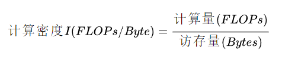
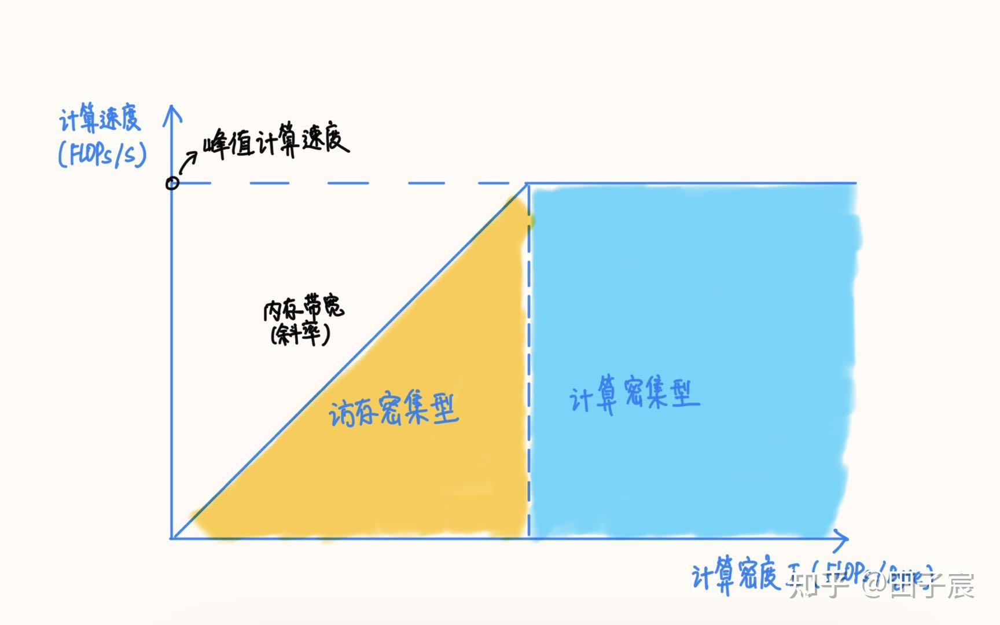

# 深度学习模型大小与模型推理速度的探讨

2021.11.12

> Source: [https://zhuanlan.zhihu.com/p/411522457](https://zhuanlan.zhihu.com/p/411522457)

## 1. 常用评估指标

1. 计算量
    * FLOPs：Floating Point Operations，浮点计算次数。
2. 参数量
    * 参数量是模型中的参数的总和，跟模型在磁盘中所需的空间大小直接相关。
    * 参数量往往是被算作访存量的一部分，因此参数量不直接影响模型推理性能。但是参数量一方面会影响内存占用，另一方面也会影响程序初始化的时间。
3. 访存量
    * 访存量是指模型计算时所需访问存储单元的字节大小，反映了模型对存储单元带宽的需求。访存量一般用 Bytes（或者 KB/MB/GB）来表示，即模型计算到底需要存/取多少 Bytes 的数据。
    * 和计算量一样，模型整体访存量等于模型各个算子的访存量之和。对于 Eltwise Sum 来讲，两个大小均为 (N, C, H, W) 的 Tensor 相加，访存量是(2 + 1) x N x C x H x W x sizeof(data_type)，其中2代表读2个Tensor，1代表写1个Tensor。
    * 访存量对模型的推理速度至关重要，设计模型时需要予以关注。
4. 内存占用
    * 内存占用是指模型运行时，所占用的内存/显存大小。一般有工程意义的是最大内存占用，内存占用≠访存量。
    * 和参数量一样，内存占用不会直接影响推理速度，往往算作访存量的一部分。

## 2. 计算量越小，模型推理就越快吗？

实际上计算量和实际的推理速度之间**没有直接的因果关系**。计算量仅能作为模型推理速度的一个参考依据。

模型在特定硬件上的推理速度，除了受计算量影响外，还会受访存量、硬件特性、软件实现、系统环境等诸多因素影响，呈现出复杂的特性。因此，有硬件且测试方便的情况下，实测是最准确的性能评估方式。

### 2.1 计算密度与RoofLine模型

计算密度是指一个程序在单位访存量下所需的计算量，单位是 FLOPs/Byte。

