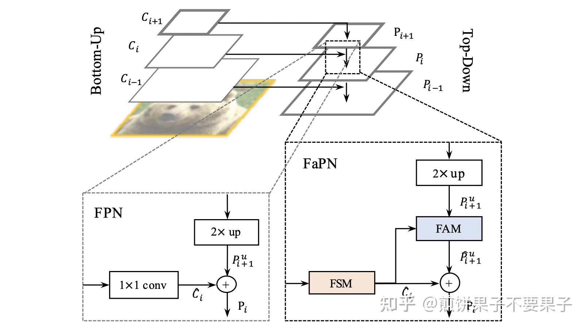
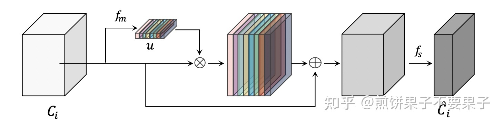
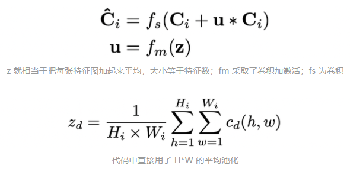
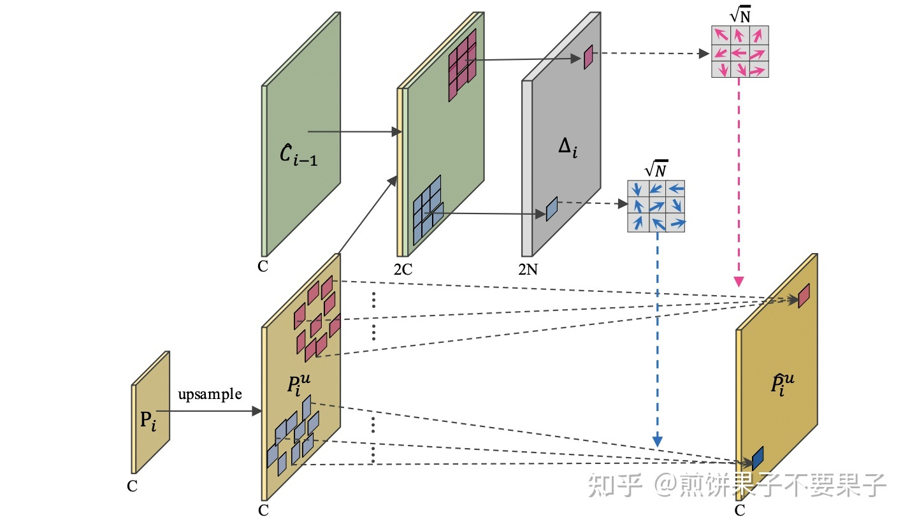
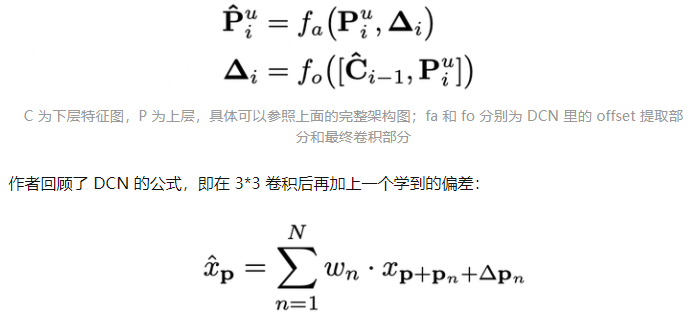
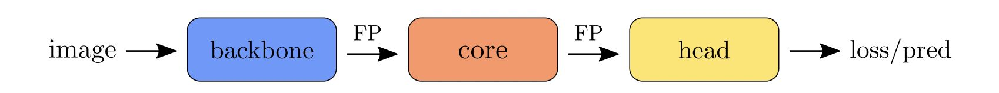
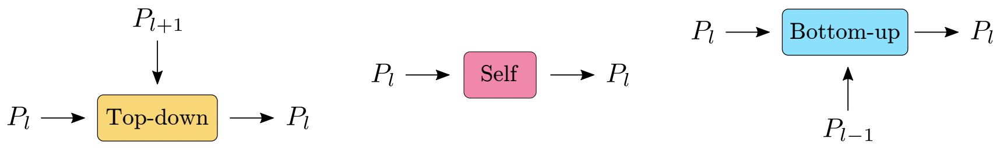
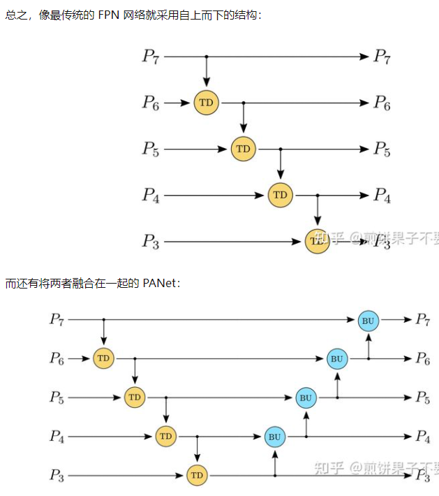
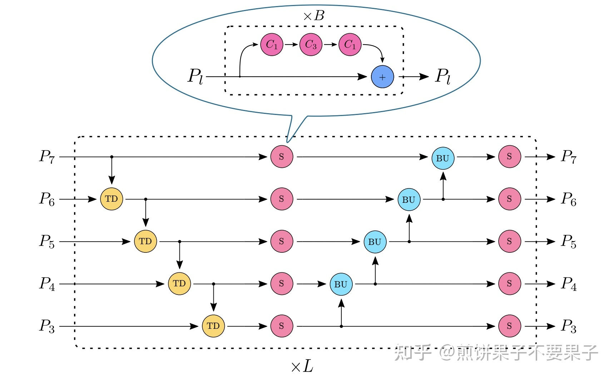
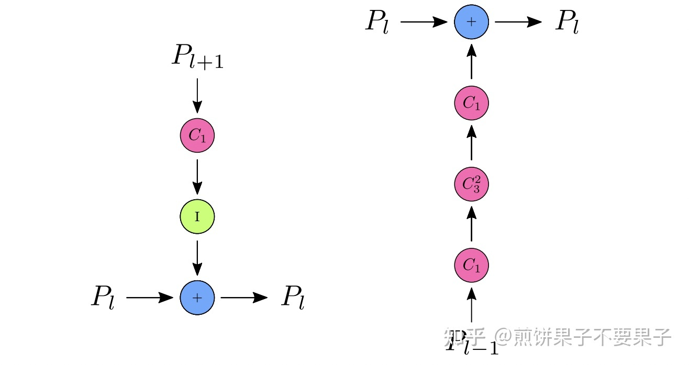

# DCN and TPN

2021.11.12
> Source: [https://zhuanlan.zhihu.com/p/418175718](https://zhuanlan.zhihu.com/p/418175718) & [https://zhuanlan.zhihu.com/p/422762423](https://zhuanlan.zhihu.com/p/422762423)

## DCN

### 主要思路和创新点

一共提出了两个模块，一个是特征对齐模块（FAM: Feature Alignment Module），一个是特征选取模块（FSM: Feature Selection Module）。作者称这样的结构可以帮助模型获得更多的位置信息。

<!--  -->

    

下面分别说一下两个模块，首先是 FSM。在传统 FPN 中，对于下层特征图，仅进行一个 1*1 的卷积就输入网络。作者提出应该对其进一步研究，筛选出重要的特征输入网络，其实就是卷积激活一系列操作

<!--  -->

    

<!--  -->

    

FAM 结构相对复杂，作者采用的 deformable 卷积，保证一些 offset 会让上层特征和下层特征位置上完美匹配：

<!--  -->

    

把 DCN（Deformable Convolution Network） 打包后

<!--  -->

    

## TPN

### 主要思路和创新点

<!--  -->

    

上图是文中对于计算机视觉任务的一个概括定义，模型一般由骨架网络 / 核心 / 针对不同任务设计的输出端组成。特征金字塔网络就是核心部分，旨在处理骨架网络输出特征图，让其更好地适应下游任务。

传统金字塔方法关注点几乎都在提出如何融合不同分辨率特征图的方法，概括起来有两种，一种自上而下，一种自下而上：

<!--  -->

    

<!--  -->

    

因此作者总结，这些核心部分只关注了相邻层特征图的融合，没有考虑自身特征图的一些优化，就是上上上图中间的粉色模块，本文的创新点也在此。可以看下整体结构图：

<!--  -->

    

其中， C1代表 1x1 的卷积、批标准化和 ReLU 激活层；C3其中的卷积核则为 3x3。而对于自上而下和自下而上结构，则采用了和之前差不多的操作

<!--  -->

    

