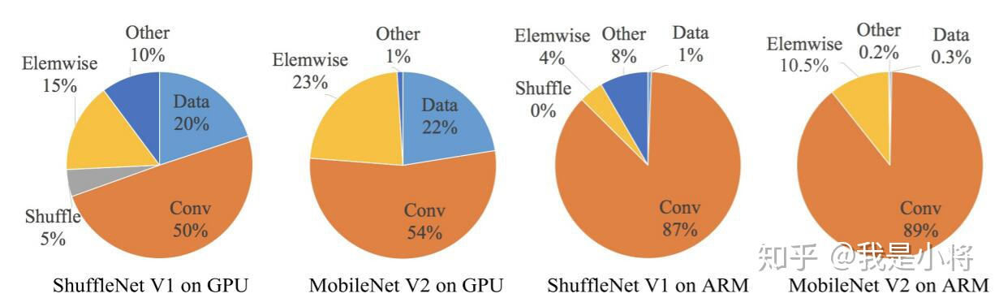
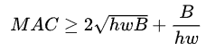
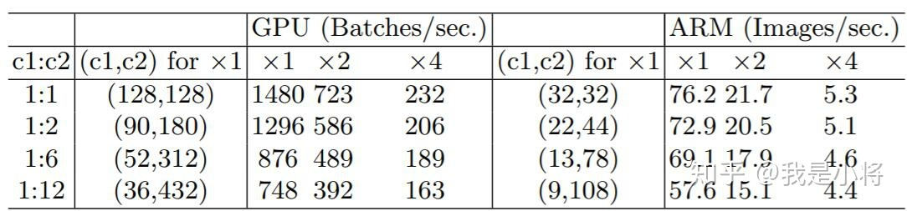
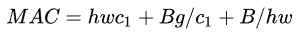
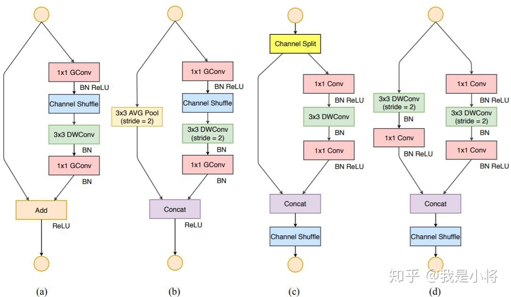
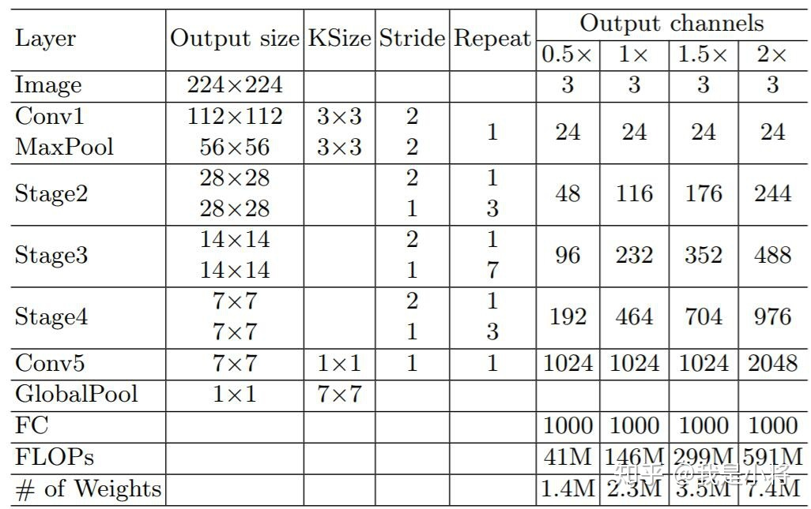

# ShuffleNetV2

2021.11.12

> Source: [https://zhuanlan.zhihu.com/p/48261931](https://zhuanlan.zhihu.com/p/48261931)

## 设计理念

目前衡量模型复杂度的一个通用指标是FLOPs，具体指的是multiply-add数量，但是这却是一个间接指标，因为它不完全等同于速度。如图1中的（c）和（d），可以看到相同FLOPs的两个模型，其速度却存在差异。这种不一致主要归结为两个原因，首先影响速度的不仅仅是FLOPs，如内存使用量（memory access cost, MAC），这不能忽略，对于GPUs来说可能会是瓶颈。另外模型的并行程度也影响速度，并行度高的模型速度相对更快。另外一个原因，模型在不同平台上的运行速度是有差异的，如GPU和ARM，而且采用不同的库也会有影响。

<!--  -->

    

据此，作者在特定的平台下研究ShuffleNetv1和MobileNetv2的运行时间，并结合理论与实验得到了4条实用的指导原则。

（G1）**同等通道大小最小化内存访问量**。对于轻量级CNN网络，常采用深度可分割卷积（depthwise separable convolutions），其中点卷积（ pointwise convolution）即1x1卷积复杂度最大。这里假定输入和输出特征的通道数分别为c1和c2，特征图的空间大小为h和w，那么1x1卷积的FLOPs为B = h x w x c1 x c2。对应的MAC为 h x w x (c1 + c2) + c1 x c2，根据均值不等式，固定B的时候，MAC存在下限：

<!--  -->

    

仅当 c1 = c2，MAC取最小值，这个理论分析也通过实验得到证实，如表1所示，通道比为1:1时速度更快。

<!--  -->

    

（G2）**过量使用组卷积会增加MAC**。组卷积（group convolution）是常用的设计组件，因为它可以减少复杂度却不损失模型容量。但是这里发现，分组过多会增加MAC。对于组卷积，FLOPs为 B = h x w x c1 x c2 / g，对应的MAC为 h x w x (c1 + c2) + c1 x c2 / g。如果固定输入以及B，MAC为

<!--  -->

    

可以看到，当 g 增加时，MAC会同时增加。这点也通过实验证实，所以明智之举是不要使用太大 g 的组卷积。

（G3）网络碎片化会降低并行度。一些网络如Inception，以及Auto ML自动产生的网络NASNET-A，它们倾向于采用“多路”结构，即存在一个lock中很多不同的小卷积或者pooling，这很容易造成网络碎片化，减低模型的并行度，相应速度会慢，这也可以通过实验得到证明。

（G4）不能忽略元素级操作。对于元素级（element-wise operators）比如ReLU和Add，虽然它们的FLOPs较小，但是却需要较大的MAC。这里实验发现如果将ResNet中残差单元中的ReLU和shortcut移除的话，速度有20%的提升。

上面4条指导准则总结如下：

* 1x1卷积进行平衡输入和输出的通道大小；
* 组卷积要谨慎使用，注意分组数；
* 避免网络的碎片化；
* 减少元素级运算。

## 网络结构

<!--  -->

    

在ShuffleNetv1的模块中，大量使用了1x1组卷积，这违背了G2原则，另外v1采用了类似ResNet中的瓶颈层（bottleneck layer），输入和输出通道数不同，这违背了G1原则。同时使用过多的组，也违背了G3原则。短路连接中存在大量的元素级Add运算，这违背了G4原则。

为了改善v1的缺陷，v2版本引入了一种新的运算：channel split。具体来说，在开始时先将输入特征图在通道维度分成两个分支：通道数分别为cx和c-cx。左边分支做同等映射，右边的分支包含3个连续的卷积，并且输入和输出通道相同，这符合G1。而且两个1x1卷积不再是组卷积，这符合G2，另外两个分支相当于已经分成两组。两个分支的输出不再是Add元素，而是concat在一起，紧接着是对两个分支concat结果进行channle shuffle，以保证两个分支信息交流。其实concat和channel shuffle可以和下一个模块单元的channel split合成一个元素级运算，这符合原则G4。

对于下采样模块，不再有channel split，而是每个分支都是直接copy一份输入，每个分支都有stride=2的下采样，最后concat在一起后，特征图空间大小减半，但是通道数翻倍。

ShuffleNetv2的整体结构如表2所示，基本与v1类似，其中设定每个block的channel数，如0.5x，1x，可以调整模型的复杂度。

<!--  -->

    

可以看到，在同等条件下，ShuffleNetv2相比其他模型速度稍快，而且准确度也稍好一点。同时作者还设计了大的ShuffleNetv2网络，相比ResNet结构，其效果照样具有竞争力。

从一定程度上说，ShuffleNetv2借鉴了DenseNet网络，把shortcut结构从Add换成了Concat，这实现了特征重用。但是不同于DenseNet，v2并不是密集地concat，而且concat之后有channel shuffle以混合特征，这或许是v2即快又好的一个重要原因。