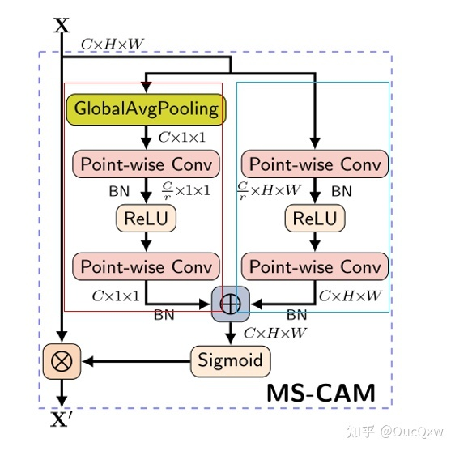
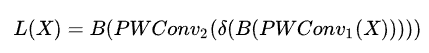
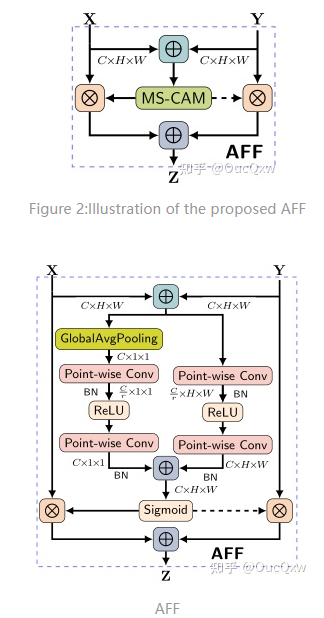
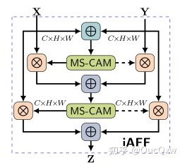

# WACV 2021 Attentional Feature Fusion

2021.11.15

> Source: [https://zhuanlan.zhihu.com/p/424031096](https://zhuanlan.zhihu.com/p/424031096)

## 1. Motivation

特征融合是来自不同层或分支的特征的组合，是现代网络体系结构中无所不在的一部分。它通常通过简单线性的操作（例如，求和（summation）或串联（concatenation）来实现，但这可能不是最佳选择。文章提出了一个统一的通用方案，即注意力特征融合（AFF），该方案适用于大多数常见场景，包括由short and long skip connections以及在Inception层内引起的特征融合。

为了更好地融合语义和尺度不一致的特征，我们提出了多尺度通道注意力模块（MS-CAM），该模块解决了融合不同尺度特征时出现的问题。我们还证明了初始特征融合可能会成为瓶颈，并提出了迭代注意力特征融合模块（iAFF）来缓解此问题。

SKNet和ResNeSt注意力特征融合存在的问题：

* 场景限制：SKNet和ResNeSt只关注同一层的特征选择，无法做到跨层特征融合
* 简单的初始集成：为了将得到的特征提供给注意力模块，SKNet通过相加来进行特征融合，而这些特征在规模和语义上可能存在很大的不一致性，对融合权值的质量也有很大的影响，使得模型表现受限
* 偏向上下文聚合尺度：SKNet和ResNeSt中的融合权值是通过全局通道注意机制生成的，对于分布更全局的信息，该机制更受青睐，但是对于小目标效果就不太好。是否可以通过神经网络动态地融合不同尺度的特征？

文章针对上述问题提出了三个模块：

* 注意特征融合模块（AFF），适用于大多数常见场景，包括由short and long skip connections以及在Inception层内引起的特征融合
* 迭代注意特征融合模块（IAFF），将初始特征融合与另一个注意力模块交替集成
* 引入多尺度通道注意力模块（MSCAM），通过尺度不同的两个分支来提取通道注意力

## 2. Method

### 2.1 Multi-scale Channel Attention Module (MS-CAM)

MS-CAM 主要是延续 ParseNet 的想法，再于 CNN 上结合 Local / Global 的特征，并在空间上用 Attention 来融合多尺度。MS-CAM 有 2 个较大的不同：

* MS-CAM通过逐点卷积来关注通道的尺度问题，而不是大小不同的卷积核，使用点卷积，为了让 MS-CAM 尽可能的轻量化
* MS-CAM不是在主干网中，而是在通道注意力模块中局部本地和全局的特征上下文特征

<!--  -->

    

局部特征的通道注意力的计算公式L(X)，通过点卷积来提取：

<!--  -->

    

PWConv1卷积将输入特征X的channel数量减少为原先的1/r，然后再通过PWConv2卷积将通道数恢复。全局特征的通道注意力计算公式G(X)，与L(X)的不同点，则是对输入X先进行一次GAP操作。计算之后的权重用来对X做注意力操作。

### 2.2 Attentional Feature Fusion (AFF)

<!--  -->

    

输入两个特征X和Y进行融合。

### 2.3 iterative Attentional Feature Fusion (iAFF)

<!--  -->

    

在注意力特征融合模块中，X和Y初始特征的融合仅是简单对应元素相加，然后作为注意力模块的输入会对最终融合权重产生影响。**作者认为如果想要对输入的特征图有完整的感知，只有将初始特征融合也采用注意力融合的机制**，一种直观的方法是使用另一个attention模块来融合输入的特征。