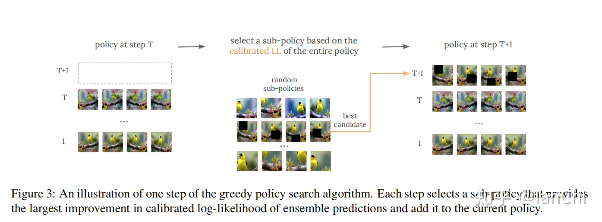
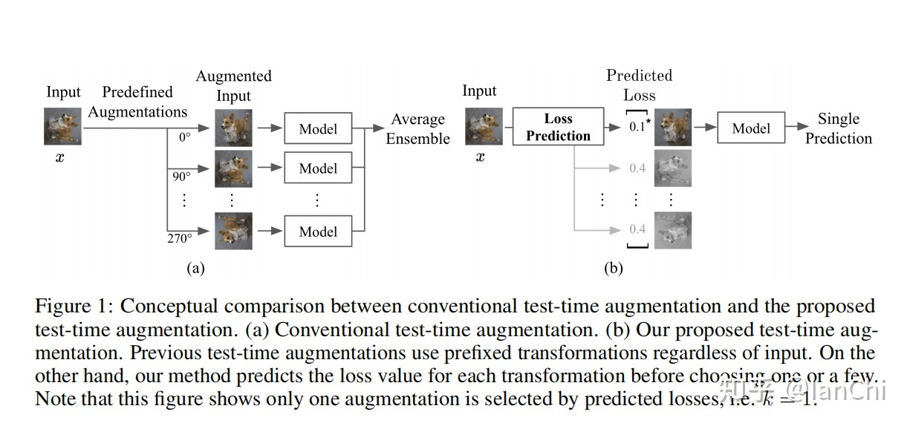
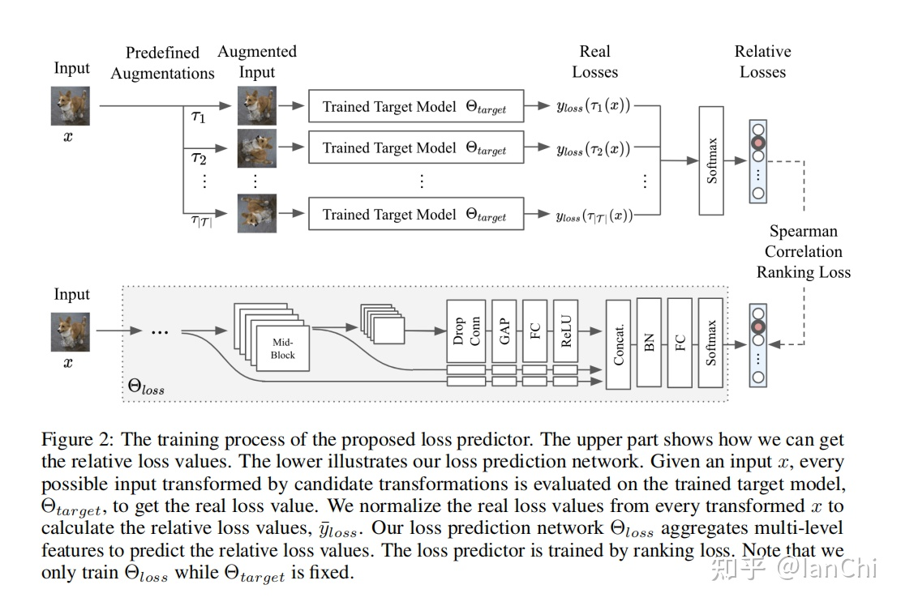

# Test Time Augmentation

2021.11.15

> Source: [https://zhuanlan.zhihu.com/p/383005472](https://zhuanlan.zhihu.com/p/383005472)

TTA (Test Time Augmentation) 这个方法非常简单、有意思，对于提升Acc和Calibration都有不错的效果。所谓TTA，思想非常简单，就是在评测阶段，给每个输入进行多种数据增广变换，将一个输入变成多个输入，然后再merge起来一起输出，形成一种ensemble的效果，一方面可以提点，另一方面可以提升model calibration （ECE来评价）的效果，实现起来也是非常简单，可以直接用Pretrained model来做，相当环保。

文献2发表在UAI 2020，提出了一种贪心算法，如下图：

<!--  -->

    

固定增广步数，每一步都从整个增广空间里选一个使得Calibrated LL提升最大的增广方式。这种方法也是非常naive的，一定不是最优的，如paper title所言，是一种简单的baseline。

文献3是文献2的一种改进，发表在NIPS 2020，提出了一种所谓Learning Loss的方法，如下图右图（左图是经典TTA）：

<!--  -->

    

本文的insight也非常简单，提出了一种基于loss prediction来select数据增广的方法，这里会多一步，需要训练一个DNN来做loss predictor，具体如下图：

<!--  -->

    

上半部分是一个产生loss predictor label的过程，利用已有的增广方式和预训练好的分类模型构造label，下半部分是学习预测loss，使得上下两个部分的loss之间的相关性更好。

文献1更像是个大作业实验报告，没太看到什么好玩的结论，文献4-6都是TTA的在医学图像领域的应用，虽然问题都是语义分割问题，但TTA的思路本身没太多变化。

有几个简单的问题值得思考：

1、哪几类数据增广方式对于提升Acc有效？为什么？

2、哪几类数据增广方式对于提升ECE有效？为什么？

3、提升Acc和ECE的增广方式是否一致？

4、有没有更优的select policy？如果我们分析出哪些增广方式对Acc或ECE影响更大，是可以极大减少policy space的，同时可以提出结合先验知识的select原则，来提升选择效率。

---

参考文献：

[1] When and Why Test-Time Augmentation Works, arXiv

[2] Greedy Policy Search: A Simple Baseline for Learnable Test-Time Augmentation, UAI 2020

[3] Learning Loss for Test-Time Augmentation, NIPS 2020

[4] Test-time augmentation for deep learning-based cell segmentation on microscopy images, Nature Research

[5] Test-time augmentation with uncertainty estimation for deep learning-based medical image segmentation, MIDL 2018

[6] Test-time Data Augmentation for Estimation of Heteroscedastic Aleatoric Uncertainty in Deep Neural Networks, MIDL 2018